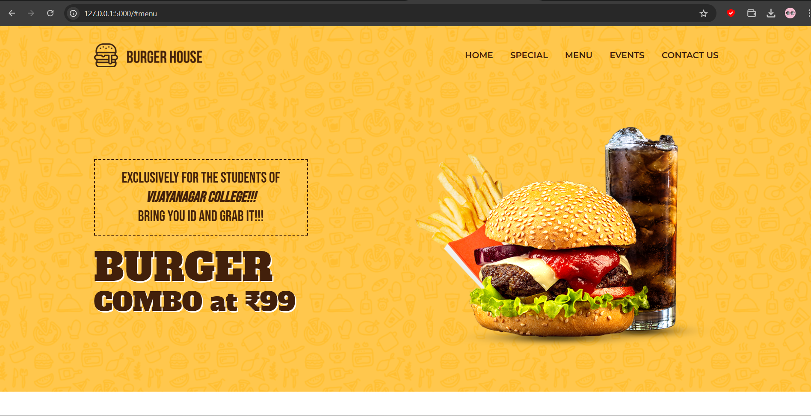
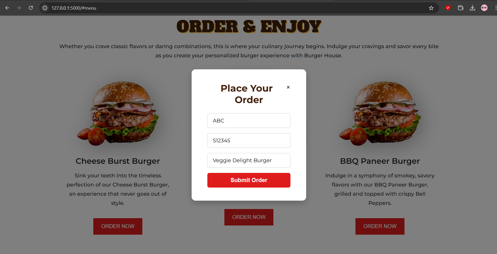
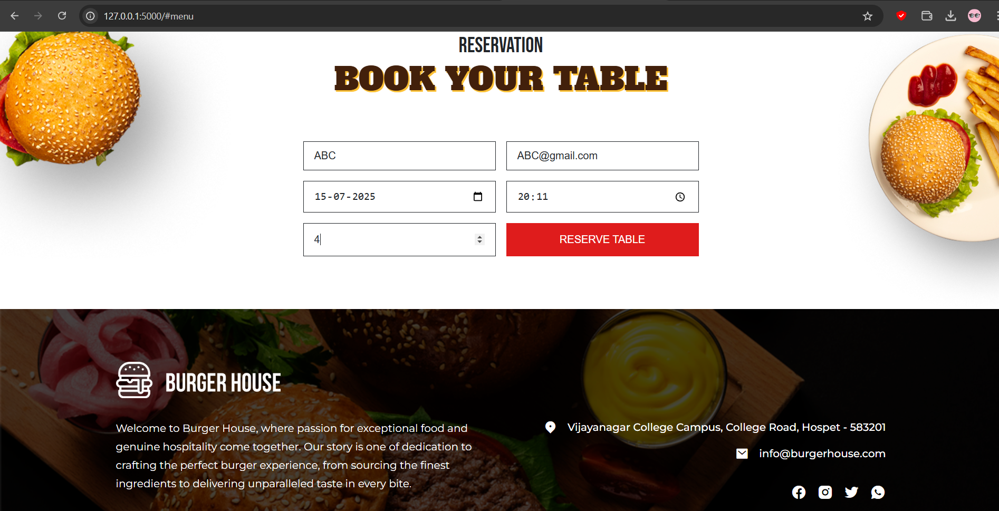

# 🍔 Burger House – Full Stack Restaurant Web App

## 🔍 Overview
**Burger House** is a full-stack restaurant website that allows customers to:
- View burgers and special offers
- Reserve tables with a form
- Place food orders with modal-based interaction

The backend is built with **Flask + SQLite**, and the frontend is responsive with HTML, CSS, and JavaScript.

---

## ⚙️ Technologies Used
- **Frontend:** HTML5, CSS3, JavaScript, ScrollReveal.js, Remix Icon
- **Backend:** Python 3, Flask, Flask-SQLAlchemy
- **Database:** SQLite

---

## 🧰 Folder Structure
```
Burger_House/
├── backend/
│   ├── app.py
│   ├── raw_db.py
│   ├── read_db.py
│   ├── requirements.txt
│   ├── instance/
│   │   └── reservations.db
│   ├── static/
│   │   ├── main.js
│   │   ├── style.css
│   │   └── assets/ (images)
│   └── templates/
│       └── index.html
├── screenshots/
│   ├── homepage.png
│   ├── order_form.png
│   └── reservation_form.png
└── README.md
```

---

## 🚀 Getting Started

### 1. Clone the Repository
```bash
git clone https://github.com/yourusername/Burger_House.git
cd Burger_House/backend
```

### 2. (Optional) Create a Virtual Environment
```bash
# Windows
python -m venv venv
venv\Scripts\activate

# macOS/Linux
python3 -m venv venv
source venv/bin/activate
```

### 3. Install Dependencies
```bash
pip install -r requirements.txt
```

### 4. Run the Flask App
```bash
python app.py
```

### 5. Open in Browser
Visit:
```
http://127.0.0.1:5000/
```

---

## ✨ Features
- 🍔 Interactive burger menu
- 📅 Table reservation form
- 🛒 Modal-based food order system
- 🎨 Clean, responsive design with animations
- 🔗 Backend APIs for order/reservation

---

## 🔌 API Endpoints (For Testing)
| Method | Endpoint              | Description              |
|--------|-----------------------|--------------------------|
| POST   | `/api/reservation`    | Create a new reservation |
| GET    | `/api/reservations`   | View all reservations    |
| POST   | `/api/order`          | Place a new food order   |

📝 Note: The SQLite database file (`reservations.db`) is auto-created in `/instance/` on first run.

---

## 📸 Screenshots

### 🏠 Homepage


### 🧾 Order Modal


### 📅 Reservation Form


---

## 💡 Future Improvements
- Add user login & admin access
- Send confirmation emails on orders/reservations
- Deploy backend using PythonAnywhere or Render
- Improve form validation & success messages

---

## 👤 Author
**Amar Sapare**  
📧 amarsaparemec9591@gmail.com  
🔗 [LinkedIn](https://linkedin.com/in/amar-sapare)

---

## 🪪 License
This project is open source and free to use under the MIT License.